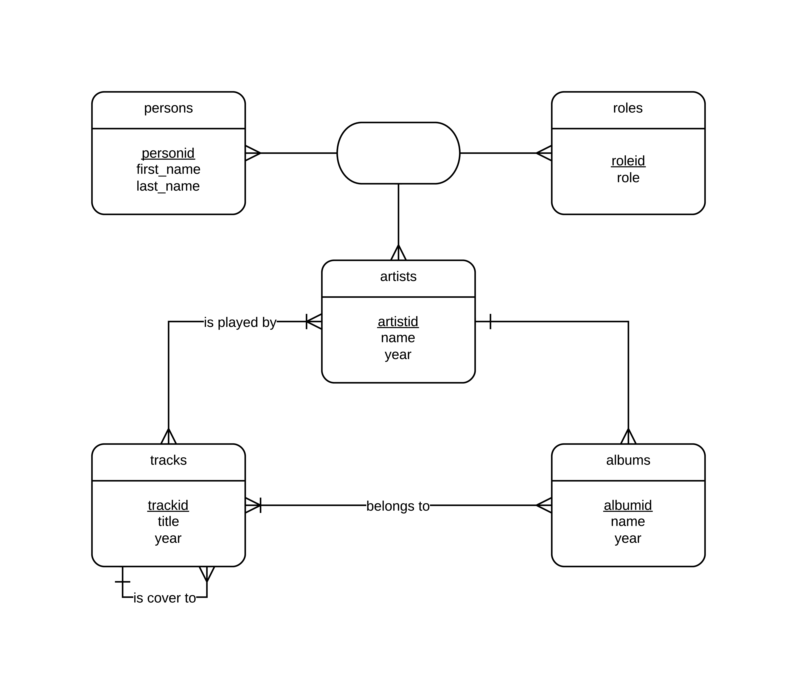

Введение в системы баз данных
=============================

Разработана база данных для хранения музыки. Исполнители, альбомы,
треки, все дела. Киллер-фича --- база кавер-версий песен.

## Картинки ##

### Entity-relationship diagram ###

Вкратце словами. Есть сущности:

* `artists`: Исполнитель. У него есть название, год основания (группы,
  например).
* `albums`: Альбом. Название, год выпуска.
* `tracks`: Песня. Название, год выпуска.
* `persons`: Человеки. Имя, фамилия.
* `roles`: Чем человеки могут заниматься: гитарист, басист, голосист,
  ...

Что выполняется:

* У песенки есть хотя бы один исполнитель.
* У альбома ровно один исполнитель (неправда в реальном мире, но кого
  это волнует).
* Кто-то может где-то чем-то заниматься (прикручено _потому что я
  могу_ и для того, чтобы база выглядела солидней) (вообще, немалая
  часть базы сделана _потому что я могу_).

### Физическая модель ###

Тут немного читов. По идее, связь много-много с одним обязательным
концом должна давать в одной из таблиц дополнительную ссылку на этого
обязательного представителя. Но мне было лень это делать и в базе
просто стоит триггер на то, что этот представитель существует.

## Внутренности ##

### Проверки инвариантов ###

#### Год выпуска альбома не меньше года создания группы ####

#### У песни хотя бы один исполнитель ####

#### Если песня в каком-либо альбоме, то один из её исполнителей издал этот альбом ####
     
### Ещё триггеры ###

На основе таблицы с каверами генерируется таблица, в которой для
каждого кавера хранится корень этого дерева каверов. Она нужна для
того, чтобы сделать таблицу `numcovers`, которая хранит, сколько для
каждой песни есть каверов.

### `MATERIALIZED VIEW numcovers` ###

Оно материализовано исключительно потому что я могу. А ещё затем,
чтобы навесить на него индекс (тоже только потому, что я могу).

### `VIEW numcovers2` ###

Выполняет те же функции, что и `numcovers` --- для песни говорит,
сколько у неё каверов в поддереве, но реализует это с помощью
рекурсивного запроса, строя транзитивное замыкание графа.

## Сборка ##

`make`
`psql`

Основной файл --- `music.sql`
